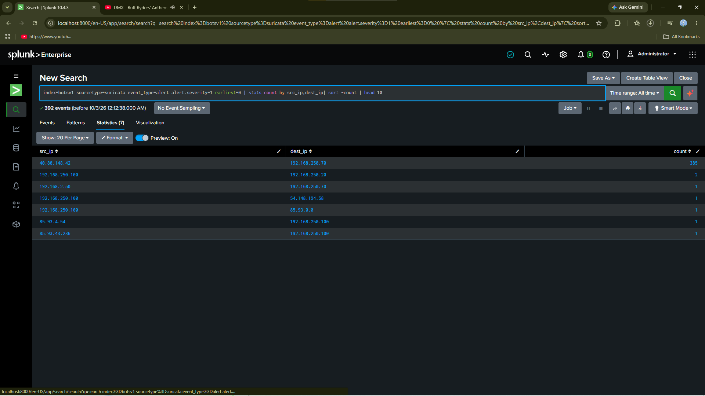
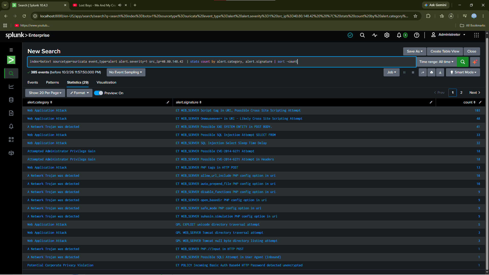
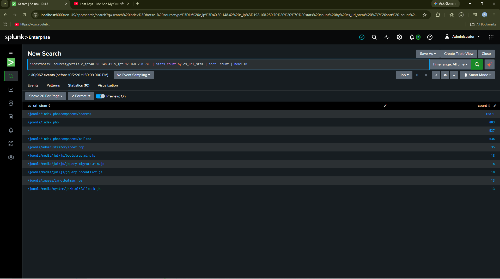
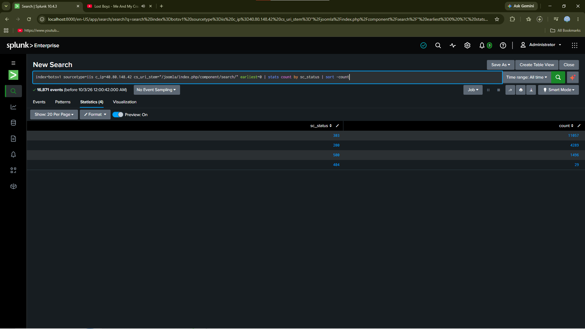
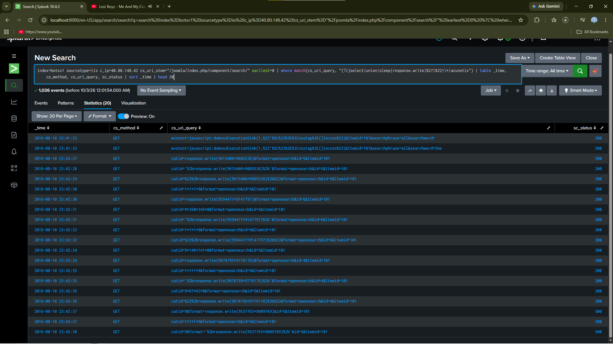
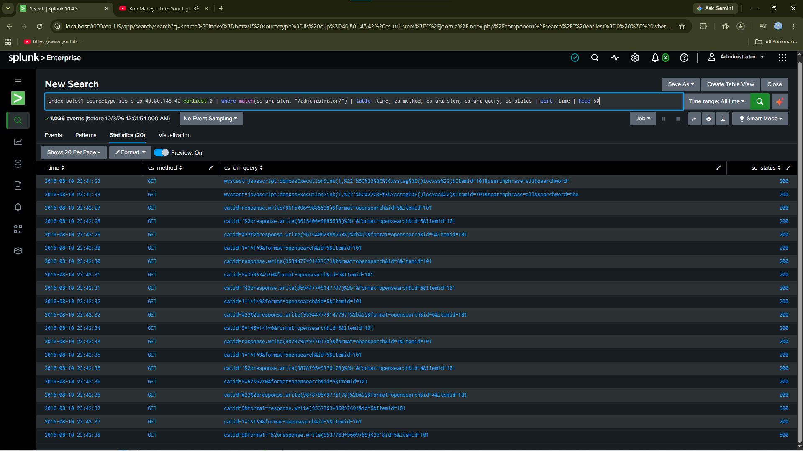

# Splunk BOTSv1 — Web Compromise Investigation

A full incident investigation of a Joomla web application compromise in the BOTSv1 dataset, using Splunk SPL. This repo documents the end-to-end hunt: from IDS alert to confirmed Remote Code Execution.

## Findings at a glance

| Item | Value |
|---|---|
| **Attacker** | `40.80.148.42` (external) |
| **Victim** | `192.168.250.70` (Joomla web server) |
| **Initial vector** | SQL injection in `com_search` component |
| **Impact** | Admin compromise + malicious extension upload + RCE via eXtplorer |
| **Attack window** | 2016-08-10 23:36 → 23:51 UTC (~15 minutes) |
| **Evidence source** | 33M+ events across 26 sourcetypes |

## Attack chain

```
External scan (Acunetix)
    ↓
SQL injection (com_search) — 16,871 requests
    ↓
Admin panel login (POST → 303)
    ↓
Malicious extension upload (com_installer&view=install)
    ↓
eXtplorer file manager loaded
    ↓
Remote Code Execution (include_javascript&file=...)
```

## Skills demonstrated

- Splunk SPL — stats, where match, bin, table, rex
- Suricata IDS analysis — alert severity, signature identification
- IIS W3C log analysis — request/response correlation
- Cross-sourcetype pivoting (network → application)
- IOC extraction and payload decoding
- MITRE ATT&CK mapping
- Incident report writing

## Repo contents

- Full incident report (incident-report.md)
- Methodology (methodology.md)
- Queries (queries/) — 8 .spl files
- IOCs (iocs/indicators.md)

## Quick start

1. Install Splunk Enterprise (free license)
2. Download BOTSv1 dataset from Splunk's GitHub
3. Create index botsv1 and install the app
4. Run the queries in queries/ in order

## Notes

All investigation was performed on the public BOTSv1 dataset — no real client or production data is included.


## Visual evidence

### Attacker identified — 385 of 392 high-severity alerts


### Attack signatures — SQL injection, XSS, XXE, Shellshock


### IIS URLs — dominant attack endpoint


### Status codes — 91% success rate


### Payloads — SQL injection in query strings


### Persistence — malicious extension installed


